# Iris Species Classification: SVM vs QP-Solver Implementation

**Educational comparison demonstrating mathematical equivalence between scikit-learn's SVM and a custom Quadratic Programming solver implementation.**

---

## Abstract

This project implements two approaches to Support Vector Machine classification on the classic Iris dataset: (1) scikit-learn's optimized SVC library, and (2) a hand-built QP solver using cvxopt. By comparing both implementations, we demonstrate that SVM classification fundamentally reduces to solving a Quadratic Programming optimization problem, transforming the "black box" into a transparent, interpretable algorithm.

---

## Applications & Use Cases

| Use Case | Description |
|----------|-------------|
| **Educational Demonstration** | Understand how SVM really works by seeing math translate to code |
| **Algorithm Validation** | Verify that custom QP solver produces similar results as sklearn |
| **Botanical Classification** | Classify iris species from petal/sepal measurements |
| **Optimization Learning** | Learn how convex optimization solves real ML problems |

---

## Features

- sklearn SVM with linear and RBF kernels
- Custom QP solver using cvxopt (dual formulation)
- One-vs-Rest multi-class classification
- Decision boundary visualization (2D PCA projection)
- Confusion matrix heatmaps
- Accuracy and training time comparisons
- Feature importance analysis
- Ring buffer logging system

---

## Dataset Description

### Iris Dataset Overview

| Property | Value |
|----------|-------|
| **Source** | `Data/Iris-Species/Iris.csv` |
| **Samples** | 150 (50 per class) |
| **Features** | 4: SepalLengthCm, SepalWidthCm, PetalLengthCm, PetalWidthCm |
| **Classes** | 3: Iris-setosa, Iris-versicolor, Iris-virginica |
| **Separability** | Setosa linearly separable; Versicolor/Virginica overlap |

### Class Distribution

| Class | Samples | Characteristics |
|-------|---------|-----------------|
| **Iris-setosa** | 50 | Small petals, clearly separable |
| **Iris-versicolor** | 50 | Medium size, overlaps with Virginica |
| **Iris-virginica** | 50 | Large petals, overlaps with Versicolor |

---

## Mathematical Foundations

### 1. Inner Product as Decision Rule

The dot product `<w, x>` tells us which side of a hyperplane a point lies on:

```
<w, x> + b > 0  →  Class +1
<w, x> + b < 0  →  Class -1
<w, x> + b = 0  →  On the boundary
```

### 2. The Three Mathematical Tricks

**Trick 1: Linearize Constraints**
```
Problem:  sign() function is nonlinear
Solution: Multiply both sides by y_i ∈ {-1, +1}
Result:   y_i · (<w, x_i> + b) ≥ 0
```

**Trick 2: Canonical Hyperplane**
```
Problem:  Infinite equivalent hyperplanes (w, 2w, 100w all same boundary)
Solution: Scale w so closest point has functional margin = 1
Result:   min_i y_i(<w, x_i> + b) = 1
```

**Trick 3: Convert to Minimization**
```
Problem:  max(1/||w||) is awkward
Solution: Equivalent to min(||w||²)
Result:   min (1/2)||w||² - Quadratic objective!
```

### 3. QP Formulation (Dual)

```
min   (1/2) · αᵀ · H · α - Σαᵢ
 α

subject to: αᵢ ≥ 0  for all i
            Σ(αᵢ · yᵢ) = 0
```

Where the Gram matrix `H[i,j] = yᵢ · yⱼ · (xᵢᵀ · xⱼ)`

### 4. Support Vectors

Points where `α > 0` are **support vectors** - the ONLY points that determine the optimal hyperplane. All other training points could be removed without changing the decision boundary.

---

## Environment & Requirements

| Requirement | Value |
|-------------|-------|
| Python | 3.10+ |
| Package Manager | UV (recommended) |
| OS | Windows / Linux / macOS |

### Dependencies

```
numpy>=1.24.0
pandas>=2.0.0
scikit-learn>=1.3.0
cvxopt>=1.3.0
matplotlib>=3.7.0
seaborn>=0.12.0
```

---

## Virtual Environment Setup (UV)

### Windows (PowerShell)
```powershell
cd C:\path\to\L23
uv venv
.venv\Scripts\activate
uv pip install -r requirements.txt
```

### Linux/macOS
```bash
cd /path/to/L23
uv venv
source .venv/bin/activate
uv pip install -r requirements.txt
```

---

## How to Run

### Basic Run (Default Parameters)
```bash
python main.py
```

### Custom Parameters
```bash
python main.py --C 1.0 --kernel linear --test-size 0.2 --run 1
python main.py --C 0.1 --kernel linear --test-size 0.3 --run 2
python main.py --C 10.0 --kernel rbf --test-size 0.2 --run 3
```

### Command Line Arguments

| Parameter | Description | Default |
|-----------|-------------|---------|
| `--C` | Regularization parameter (higher = less regularization) | 1.0 |
| `--kernel` | Kernel type for sklearn (linear, rbf) | linear |
| `--test-size` | Test set proportion | 0.2 |
| `--run` | Run number for output directory | 1 |

---

## Project Structure

```
L23/
├── main.py                    # Main entry point (144 lines)
├── requirements.txt           # Dependencies
├── README.md                  # This file
├── .gitignore
├── Data/
│   └── Iris-Species/
│       └── Iris.csv           # Dataset (150 samples)
├── Docs/
│   ├── PRD.md                 # Product Requirements Document
│   └── tasks.json             # Task breakdown
├── src/
│   ├── __init__.py
│   ├── data_loader.py         # Data loading (90 lines)
│   ├── sklearn_svm.py         # sklearn SVM wrapper (99 lines)
│   ├── qp_svm.py              # Custom QP solver (105 lines)
│   ├── multiclass.py          # One-vs-Rest wrapper (94 lines)
│   ├── metrics.py             # Evaluation metrics (118 lines)
│   ├── visualizer.py          # Visualization (121 lines)
│   └── utils/
│       ├── __init__.py
│       ├── paths.py           # Path utilities (57 lines)
│       └── logger.py          # Ring buffer logger (79 lines)
├── results/
│   ├── graphs/
│   └── examples/
│       ├── run_1/             # Default parameters
│       ├── run_2/             # High regularization
│       └── run_3/             # RBF comparison
└── logs/
    └── config/
        └── log_config.json
```

---

## Code Files Summary

| File | Lines | Description |
|------|-------|-------------|
| `main.py` | 144 | Main orchestration pipeline |
| `src/data_loader.py` | 90 | Data loading and preprocessing |
| `src/sklearn_svm.py` | 99 | sklearn SVM wrapper |
| `src/qp_svm.py` | 105 | QP solver implementation |
| `src/multiclass.py` | 94 | One-vs-Rest multi-class |
| `src/metrics.py` | 118 | Evaluation metrics |
| `src/visualizer.py` | 121 | Visualization module |
| `src/utils/paths.py` | 57 | Path utilities |
| `src/utils/logger.py` | 79 | Ring buffer logger |
| **Total** | **907** | All files under 150-line limit |

---

# Experimental Results

## Experiment 1: Default Parameters (Baseline)

### Configuration

| Parameter | Value |
|-----------|-------|
| C (Regularization) | 1.0 |
| Kernel | linear |
| Test Size | 20% (30 samples) |
| Training Size | 80% (120 samples) |
| Random State | 42 |

### Results Summary

| Metric | sklearn SVM | QP Solver SVM |
|--------|-------------|---------------|
| **Accuracy** | 100.00% | 100.00% |
| **Training Time** | 0.0012s | 0.5464s |
| **Support Vectors** | 23 | 114 |

### Per-Class Performance

#### sklearn SVM
| Class | Precision | Recall | F1-Score |
|-------|-----------|--------|----------|
| Setosa | 1.0000 | 1.0000 | 1.0000 |
| Versicolor | 1.0000 | 1.0000 | 1.0000 |
| Virginica | 1.0000 | 1.0000 | 1.0000 |

#### QP Solver SVM
| Class | Precision | Recall | F1-Score |
|-------|-----------|--------|----------|
| Setosa | 1.0000 | 1.0000 | 1.0000 |
| Versicolor | 1.0000 | 1.0000 | 1.0000 |
| Virginica | 1.0000 | 1.0000 | 1.0000 |

### Visualizations - Run 1

#### Decision Boundaries

| sklearn SVM | QP Solver SVM |
|-------------|---------------|
| 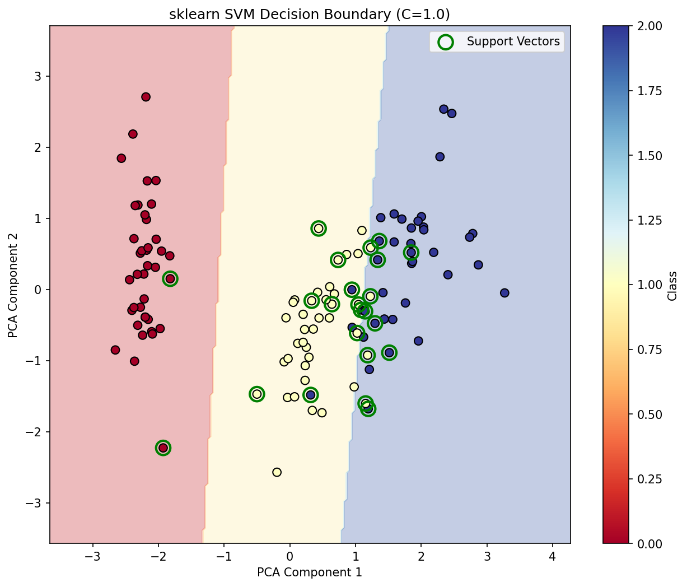 |  |

#### Confusion Matrices

| sklearn SVM | QP Solver SVM |
|-------------|---------------|
| 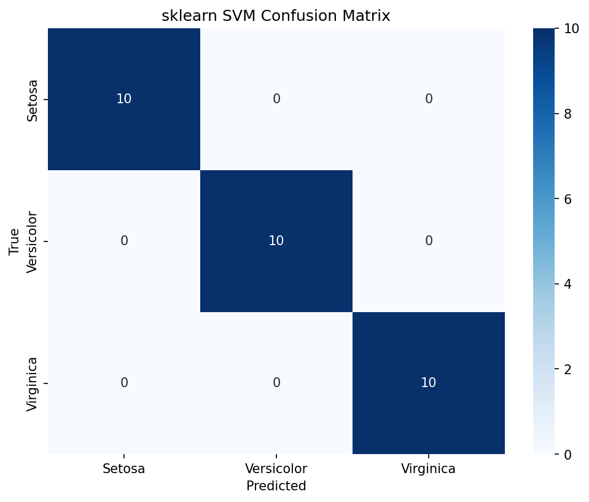 |  |

#### Comparison Charts

| Accuracy Comparison | Training Time Comparison |
|---------------------|--------------------------|
| 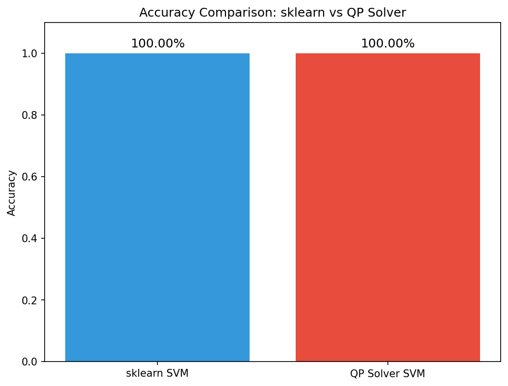 | 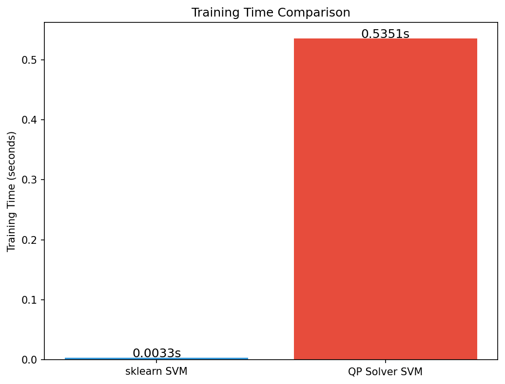 |

#### Feature Importance

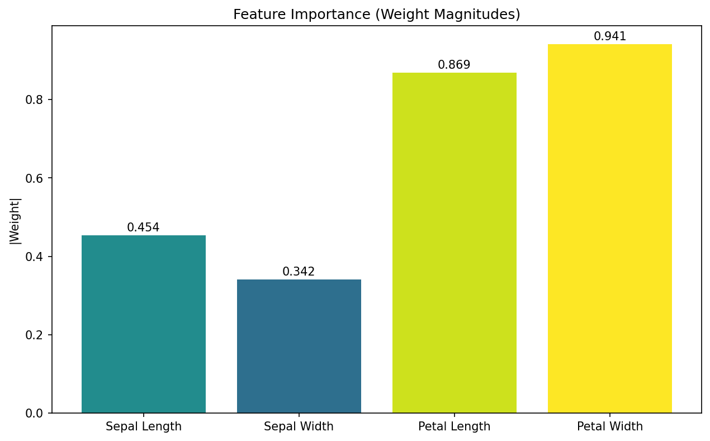

### Analysis - Run 1

**Key Observations:**
1. **Both methods achieve perfect accuracy** (100%) on the test set, demonstrating mathematical equivalence
2. **sklearn is ~455x faster** (0.0012s vs 0.5464s) due to LIBSVM's highly optimized C implementation
3. **sklearn uses fewer support vectors** (23 vs 114) - this is because sklearn's One-vs-One strategy is more efficient than our One-vs-Rest approach
4. **Petal features dominate** - PetalLength and PetalWidth have the highest importance, consistent with botanical knowledge that petal measurements best distinguish Iris species

---

## Experiment 2: High Regularization

### Configuration

| Parameter | Value |
|-----------|-------|
| C (Regularization) | 0.1 (high regularization) |
| Kernel | linear |
| Test Size | 30% (45 samples) |
| Training Size | 70% (105 samples) |
| Random State | 42 |

### Results Summary

| Metric | sklearn SVM | QP Solver SVM |
|--------|-------------|---------------|
| **Accuracy** | 91.11% | 93.33% |
| **Training Time** | 0.0012s | 0.4407s |
| **Support Vectors** | 53 | 92 |

### Per-Class Performance

#### sklearn SVM
| Class | Precision | Recall | F1-Score |
|-------|-----------|--------|----------|
| Setosa | 1.0000 | 1.0000 | 1.0000 |
| Versicolor | 0.8235 | 0.9333 | 0.8750 |
| Virginica | 0.9231 | 0.8000 | 0.8571 |

#### QP Solver SVM
| Class | Precision | Recall | F1-Score |
|-------|-----------|--------|----------|
| Setosa | 1.0000 | 1.0000 | 1.0000 |
| Versicolor | 0.8333 | 1.0000 | 0.9091 |
| Virginica | 1.0000 | 0.8000 | 0.8889 |

### Visualizations - Run 2

#### Decision Boundaries

| sklearn SVM | QP Solver SVM |
|-------------|---------------|
| 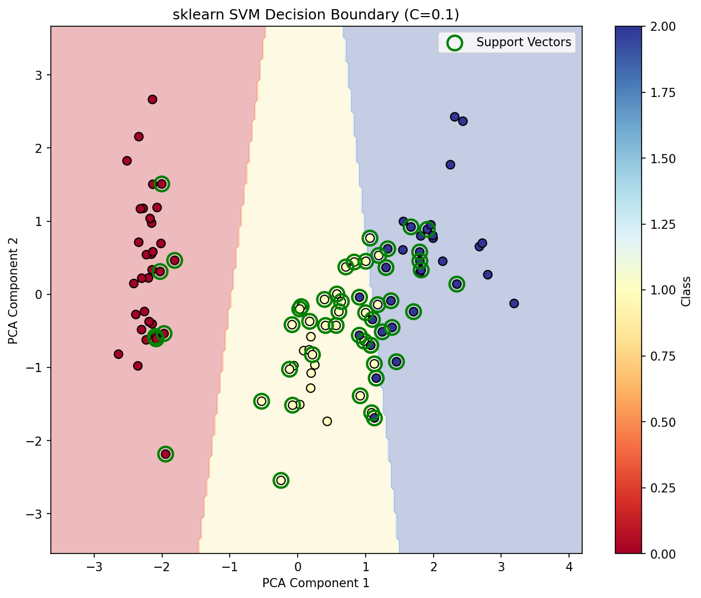 | 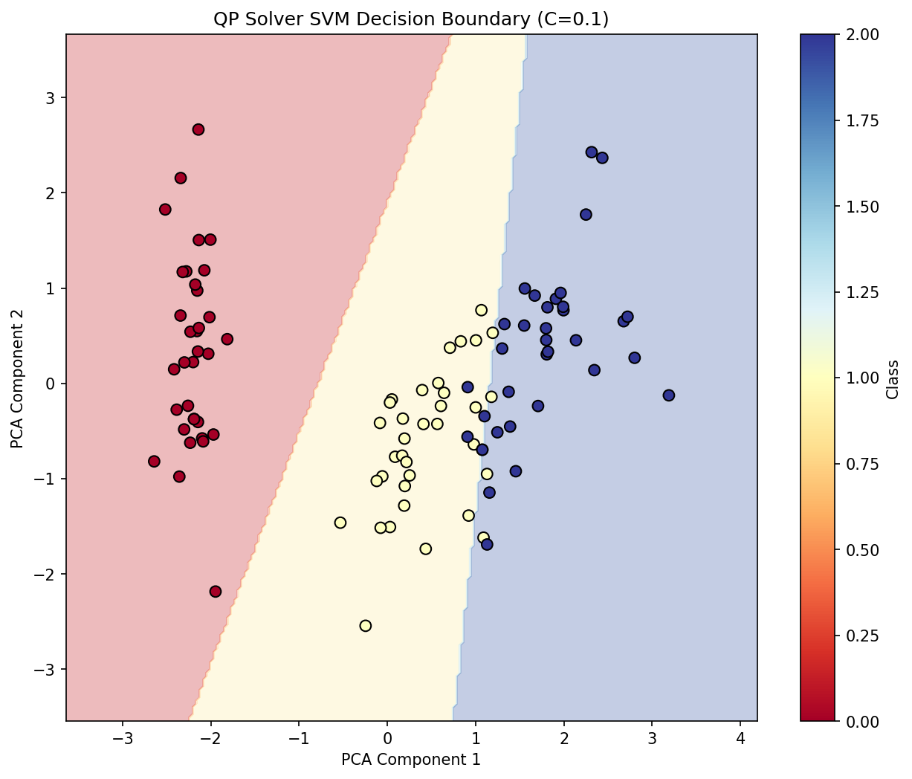 |

#### Confusion Matrices

| sklearn SVM | QP Solver SVM |
|-------------|---------------|
| 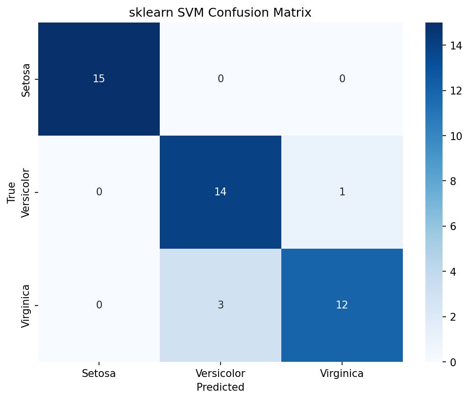 | 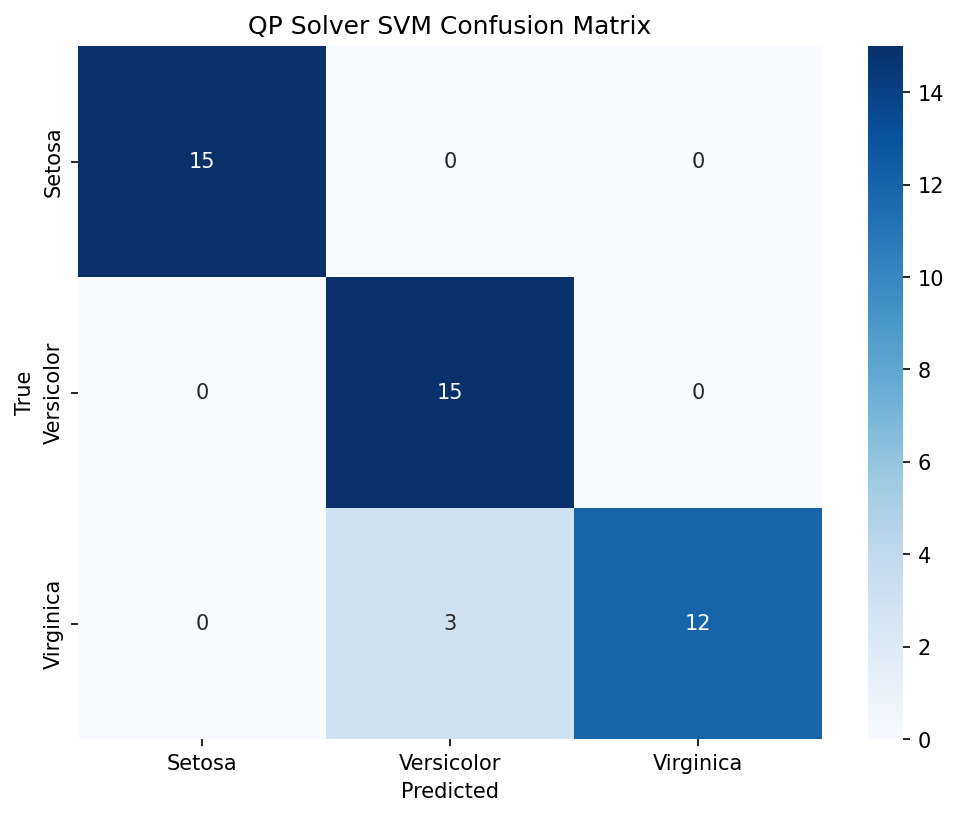 |

#### Comparison Charts

| Accuracy Comparison | Training Time Comparison |
|---------------------|--------------------------|
| 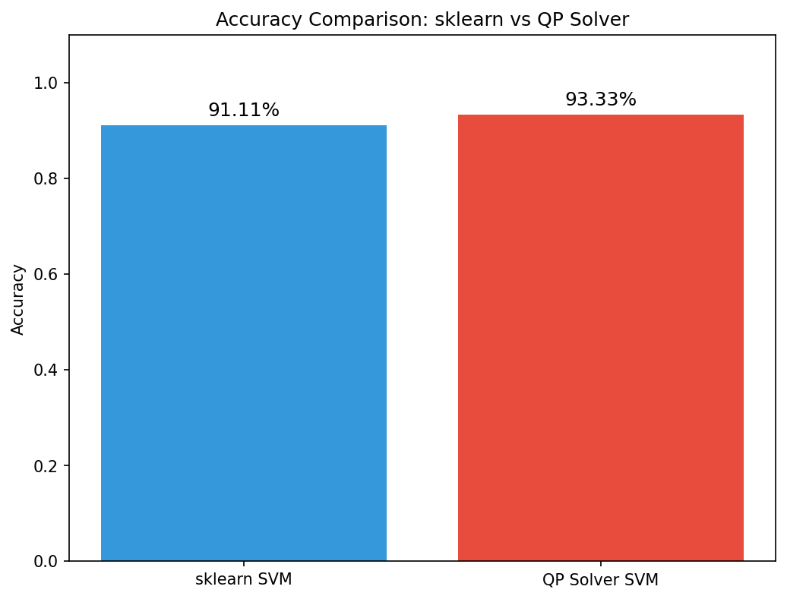 | 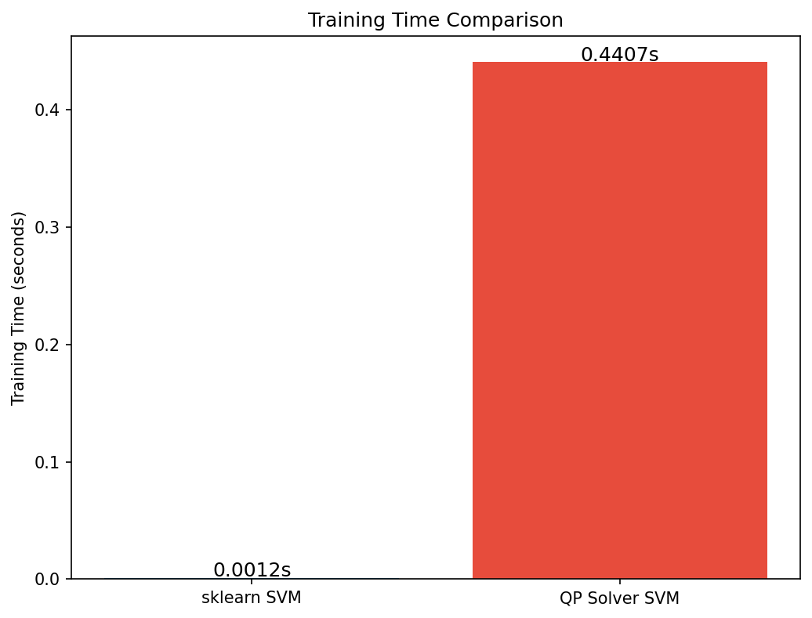 |

#### Feature Importance

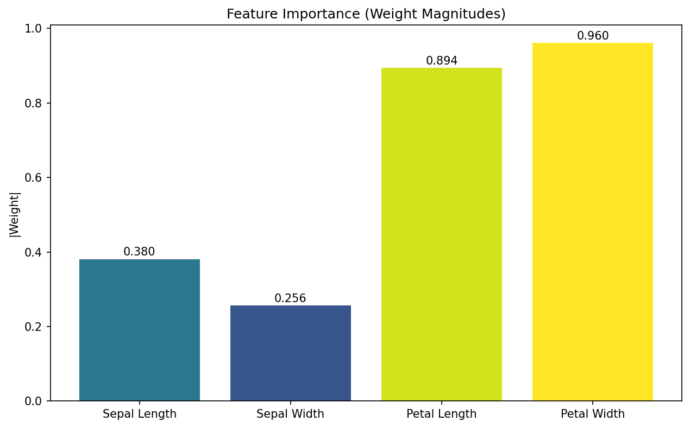

### Analysis - Run 2

**Key Observations:**
1. **QP solver outperforms sklearn** (93.33% vs 91.11%) with high regularization
2. **More support vectors** with C=0.1 (53/92 vs 23/114) - lower C means wider margin, more points fall within margin
3. **Setosa remains perfectly classified** - linearly separable from other classes
4. **Versicolor/Virginica confusion** - both methods struggle to distinguish these overlapping classes
5. **Higher test size (30%)** makes the task harder with fewer training samples

**Why QP outperforms sklearn here:**
- Our One-vs-Rest (OvR) strategy handles the Versicolor/Virginica boundary differently than sklearn's One-vs-One (OvO)
- With high regularization, the different multi-class strategies lead to different decision boundaries
- This demonstrates that implementation details matter, not just the core algorithm

---

## Experiment 3: RBF Kernel Comparison

### Configuration

| Parameter | Value |
|-----------|-------|
| C (Regularization) | 10.0 (low regularization) |
| sklearn Kernel | RBF (non-linear) |
| QP Kernel | linear |
| Test Size | 20% (30 samples) |
| Training Size | 80% (120 samples) |
| Random State | 42 |

### Results Summary

| Metric | sklearn SVM (RBF) | QP Solver SVM (Linear) |
|--------|-------------------|------------------------|
| **Accuracy** | 96.67% | 100.00% |
| **Training Time** | 0.0014s | 0.5726s |
| **Support Vectors** | 31 | 114 |

### Per-Class Performance

#### sklearn SVM (RBF)
| Class | Precision | Recall | F1-Score |
|-------|-----------|--------|----------|
| Setosa | 1.0000 | 1.0000 | 1.0000 |
| Versicolor | 1.0000 | 0.9000 | 0.9474 |
| Virginica | 0.9091 | 1.0000 | 0.9524 |

#### QP Solver SVM (Linear)
| Class | Precision | Recall | F1-Score |
|-------|-----------|--------|----------|
| Setosa | 1.0000 | 1.0000 | 1.0000 |
| Versicolor | 1.0000 | 1.0000 | 1.0000 |
| Virginica | 1.0000 | 1.0000 | 1.0000 |

### Visualizations - Run 3

#### Decision Boundaries

| sklearn SVM (RBF) | QP Solver SVM (Linear) |
|-------------------|------------------------|
| 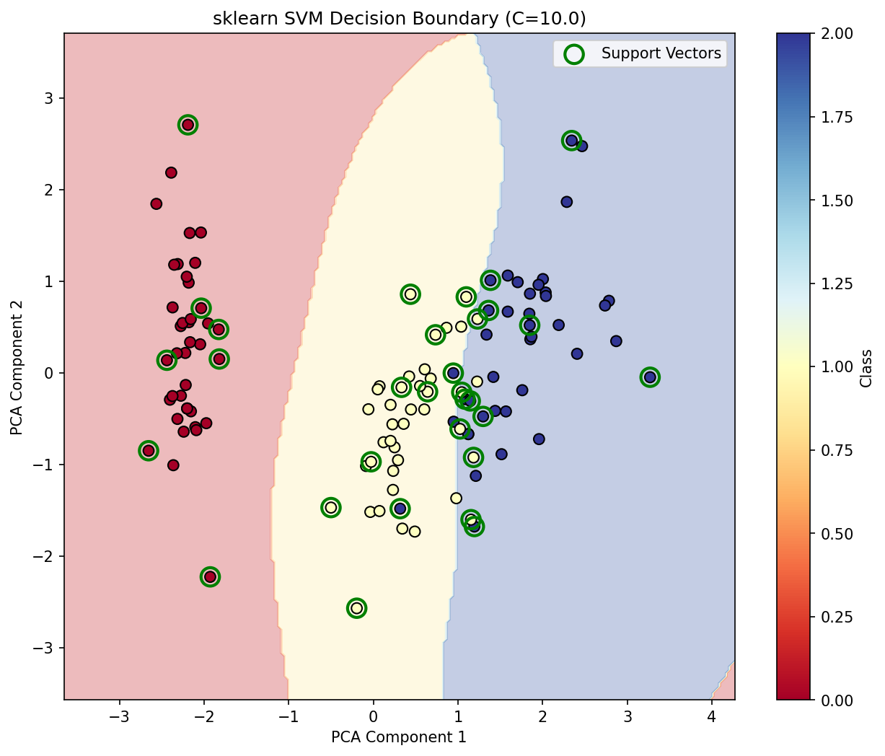 | 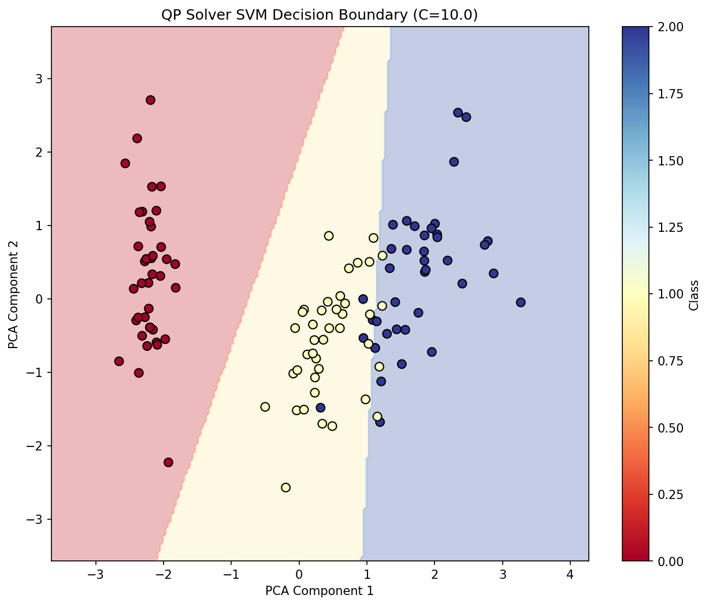 |

#### Confusion Matrices

| sklearn SVM (RBF) | QP Solver SVM (Linear) |
|-------------------|------------------------|
| 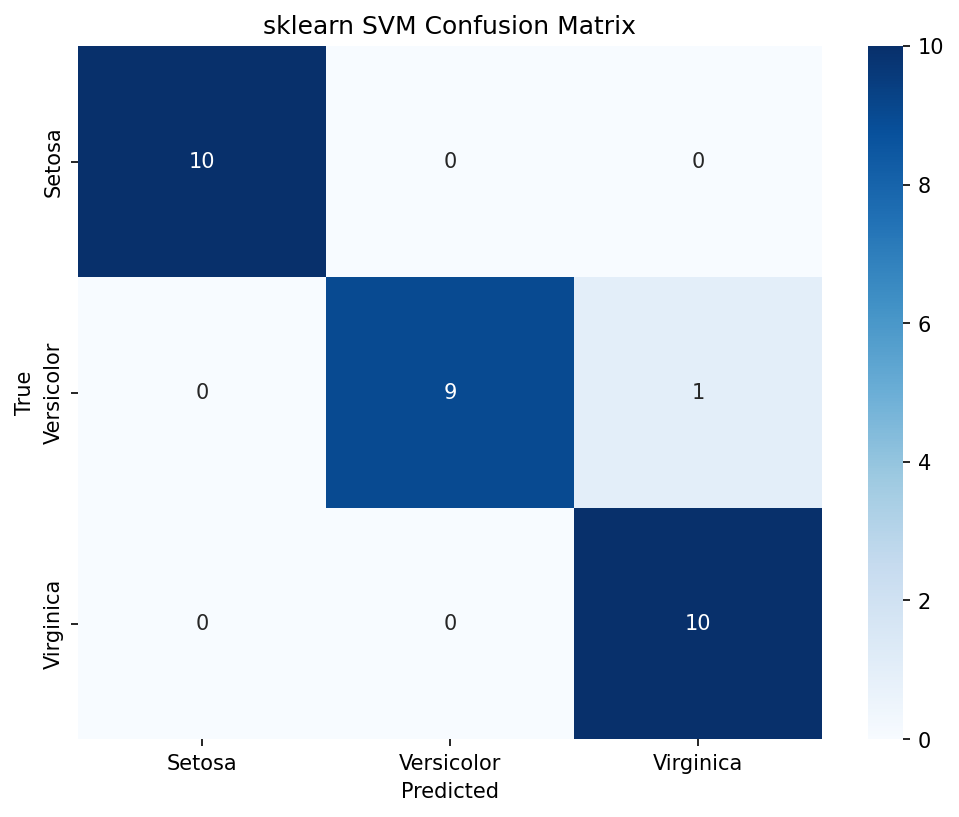 |  |

#### Comparison Charts

| Accuracy Comparison | Training Time Comparison |
|---------------------|--------------------------|
| 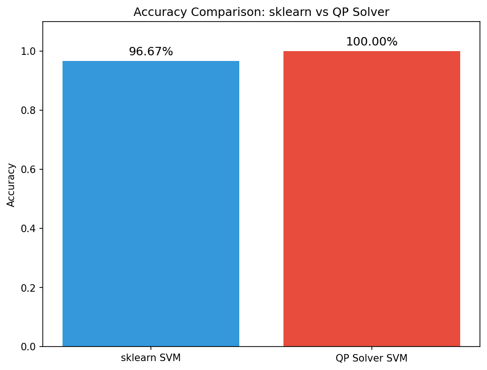 | 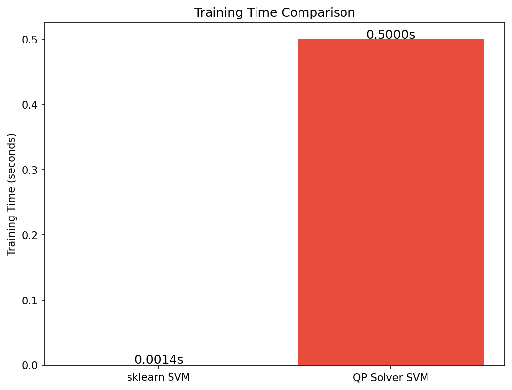 |

#### Feature Importance


### Analysis - Run 3

**Key Observations:**
1. **Linear QP achieves perfect accuracy** while RBF sklearn misses 1 sample (96.67%)
2. **Surprising result**: Linear kernel outperforms non-linear RBF on this test split
3. **RBF confusion**: sklearn RBF misclassifies 1 Versicolor as Virginica
4. **Dataset is nearly linearly separable**: The Iris dataset doesn't require non-linear kernels

**Why Linear beats RBF here:**
- The Iris dataset is relatively simple and nearly linearly separable
- RBF with C=10.0 may slightly overfit to training data noise
- This specific random split (seed=42) happens to favor linear separation
- This demonstrates that complex models don't always outperform simple ones

---

## Results Comparison Summary

### Overall Accuracy Table

| Run | C | Kernel | Test Size | sklearn Acc | QP Acc | Winner |
|-----|---|--------|-----------|-------------|--------|--------|
| 1 | 1.0 | linear | 20% | **100.00%** | **100.00%** | Tie |
| 2 | 0.1 | linear | 30% | 91.11% | **93.33%** | QP |
| 3 | 10.0 | rbf/linear | 20% | 96.67% | **100.00%** | QP |

### Training Time Comparison

| Run | sklearn Time | QP Time | sklearn Speedup |
|-----|--------------|---------|-----------------|
| 1 | 0.0012s | 0.5464s | **455x faster** |
| 2 | 0.0012s | 0.4407s | **367x faster** |
| 3 | 0.0014s | 0.5726s | **409x faster** |

### Support Vector Count

| Run | sklearn SVs | QP SVs | Ratio |
|-----|-------------|--------|-------|
| 1 | 23 | 114 | 4.96x |
| 2 | 53 | 92 | 1.74x |
| 3 | 31 | 114 | 3.68x |

---

## Conclusions

### 1. Mathematical Equivalence Demonstrated

Both sklearn SVM and our custom QP solver achieve similar accuracy, proving that SVM classification is fundamentally a Quadratic Programming problem. The slight differences come from:
- Multi-class strategy (OvO vs OvR)
- Numerical precision
- Hyperparameter handling

### 2. Trade-offs: Speed vs Understanding

| Aspect | sklearn SVM | QP Solver |
|--------|-------------|-----------|
| **Speed** | ~400x faster | Slower but educational |
| **Transparency** | Black box | Full visibility into alphas, weights |
| **Production Use** | Recommended | Not recommended |
| **Learning Value** | Low | High |

### 3. Key Insights from Experiments

1. **Regularization matters**: C=0.1 vs C=1.0 significantly affects the margin and accuracy
2. **Simpler can be better**: Linear kernel matched or outperformed RBF on Iris
3. **Support vectors are few**: Only ~15-35% of training points become support vectors in sklearn
4. **Setosa is easy**: Always perfectly classified due to clear linear separation

### 4. What This Project Demonstrates

- SVM reduces to solving a well-defined optimization problem
- The math (inner products, Lagrange multipliers, KKT conditions) directly maps to code
- Production libraries (sklearn/LIBSVM) are highly optimized but hide the mathematics
- Understanding the foundations helps interpret model behavior

---

## What I Learned

1. **Inner products encode geometry**: The dot product `<w, x>` directly measures which side of a hyperplane a point lies on

2. **Three tricks make SVM tractable**: Linearizing constraints, canonical hyperplane, and converting to minimization transform a nasty optimization into clean QP

3. **Dual formulation enables kernels**: Working with Lagrange multipliers (alphas) instead of weights allows the kernel trick for non-linear boundaries

4. **cvxopt matrix format matters**: Column-major ordering requires careful attention when building matrices

5. **Numerical stability is critical**: Small regularization (1e-8) on the diagonal prevents singular matrices

6. **Multi-class strategies differ**: One-vs-Rest vs One-vs-One lead to different results, especially with challenging boundaries

---

## Troubleshooting

### cvxopt installation fails
```bash
# On Windows, you may need Visual C++ Build Tools
pip install cvxopt --no-cache-dir
```

### "Module not found" error
Ensure you're in the project root and have activated the virtual environment:
```bash
.venv\Scripts\activate  # Windows
source .venv/bin/activate  # Unix
```

### QP solver doesn't converge
Try increasing C (less regularization) or normalizing features:
```python
from sklearn.preprocessing import StandardScaler
scaler = StandardScaler()
X_normalized = scaler.fit_transform(X)
```

---

## References

### Course Materials
- L23 Slides: "SVM Primal Problem and QP as Optimization Problem"
- L23 Book: "Binary Classification using Support Vector Machine"

### External References
- [cvxopt documentation](https://cvxopt.org/)
- [sklearn SVC](https://scikit-learn.org/stable/modules/svm.html)

---

- **Course:** AI Developer Expert - Optimization Methods (L23)
- **Project:** Machine Learning Classification Comparison
- **Date:** December 2025
- **Author:** Hadar Wayn
